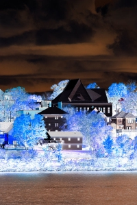
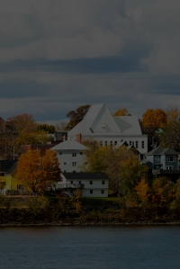

# imgo
golang图像处理工具库，图像相似度计算，图像二值化(golang image process lib)

目前只支持jpg,png

[](http://godoc.org/github.com/Comdex/imgo)

### 安装

```shell
go get github.com/Comdex/imgo
```

### 示例

```go
package main

import(
	"github.com/Comdex/imgo"
)

func main(){
    //如果读取出错会panic,返回图像矩阵img
    //img[height][width][4],height为图像高度,width为图像宽度
    //img[height][width][4]为第height行第width列上像素点的RGBA数值数组，值范围为0-255
	//如img[150][20][0]是150行20列处像素的红色值,img[150][20][1]是150行20列处像素的绿
	//色值，img[150][20][2]是150行20列处像素的蓝色值,img[150][20][3]是150行20列处像素
	//的alpha数值,一般用作不透明度参数,如果一个像素的alpha通道数值为0%，那它就是完全透明的.
    img:=imgo.MustRead("example/test.jpg")
	
	//对原图像矩阵进行日落效果处理
	img2:=imgo.SunsetEffect(img)
	
	//保存为jpeg,100为质量，1-100
	err:=imgo.SaveAsJPEG("example/new.jpg",img2,100)
	if err!=nil {
		panic(err)
	}
}
```

计算两张图片的余弦相似度
```go
	cos,err:=imgo.CosineSimilarity("test1.jpg","test2.jpg")
	if err!=nil{
		panic(err)
	}
	fmt.Println(cos)
```

### 效果

<table>
<tr>
<th><br>原图</th>
<th><br>横向镜像imgo.HorizontalMirror</th>
</tr>
<tr>
<th><br>日落imgo.SunsetEffect</th>
<th><br>负片imgo.NegativeFilmEffect</th>
</tr>
<tr>
<th><br>调整亮度imgo.AdjustBrightness</th>
<th><br>垂直镜像imgo.VerticalMirror</th>
</tr>
</table>        

更多api及帮助请访问：http://godoc.org/github.com/Comdex/imgo

### 版权

本项目采用[MIT](http://opensource.org/licenses/MIT)开源授权许可证，完整的授权说明可在[LICENSE](LICENSE)文件中找到。

